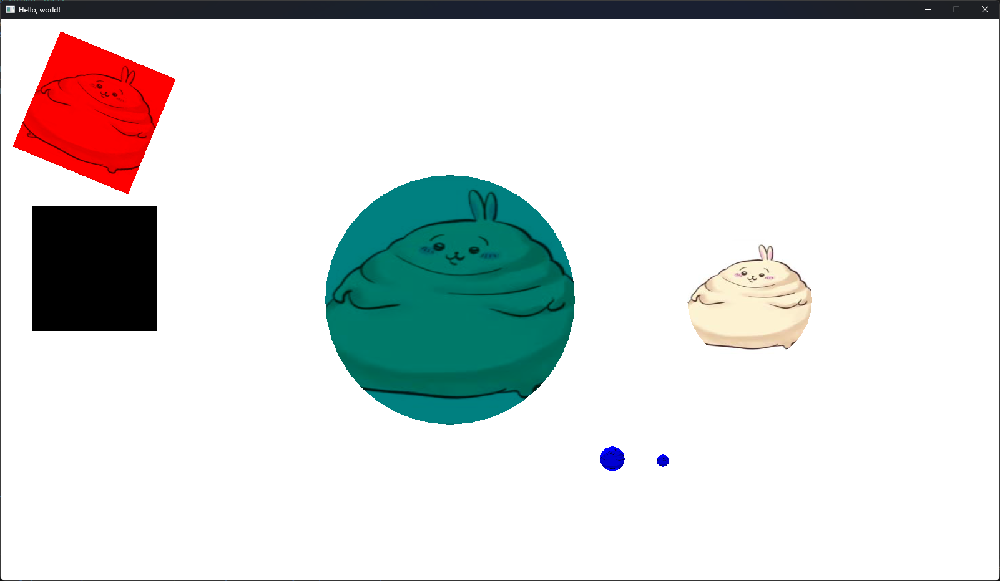

hellooo people. it's been a while since i've made my last post (3-4 months?)

i haven't worked on this website in a while too, i've been focusing on lots and Lots of other things which i will get to

i've kinda changed a lot this year,, the person who i was at the beginning of the year was someone i would find very annoying lowk (I was so insufferable in like january how did i say the shit i said with a straight face dude). and this year, i slowly started to do more frontend than backend since i thought designing and writing to a website was WAYYY more fun than figuring out the cause of a single bug in my .NET code that caused the entire project to not work. however i do still do backed occasionally. 

and this year was VERY eventful too,, i can't really count all of the major events that's happened this year without missing at least one of them. most of those events weren't that positive either,, so,,, not good!! 

anyway, here's a glimpse of what i've been working on other than this website!!!

## what have i been doing all year?

most of what i've been doing i feel like isn't that important to talk about. they're mostly just projects involving arduinos and small oled screens (it's amazing how much you can do with a tiny microcontroller)

however, there are some big projects that i HAVE been working on!! some i worked on all year, some i worked on for a few months and then stopped working randomly and then came back to it after a few months

### [Velvet](https://github.com/taxevaiden/Velvet)

everytime i do projects in like C# or something i've always wanted a cross-platform graphics library that i can use easily to do cool things. there is a really cool framework out there, [Bliss](https://github.com/MrScautHD/Bliss), that has probably 1000x more features than Velvet but anyway 

i wanted an excuse to do more graphics related stuff. i've always been interested in the topic but i've never gotten around to do that stuff. inspired by raylib and LOVE2D, i created my own library!

i haven't worked on it for a month or two, but if You guys can star the linked repository (the Velvet header) I will continue to work on it and become the best graphics library

### [song of the day](https://sotd.pages.dev)

i actually forgot if i made this website during 2024 or this year,,, anyway i still think it's important to talk about

this is one of the few websites where i actually started to care about if it looked good on a phone since i made this thinking i would pull it up while i'm on a bus or something

the ui was ~~copied~~ inspired by apple's design (before liquid ~~ass~~ glass happened)

i might redesign a little bit next year. who knows!

basically how it works is that everytime you visit the site, it fetches from a cloudflare worker.

that cloudflare worker does this:
- it generates a random number based on the current day, and does a bunch of stuff to ensure that the song of the day can't be a past one
- then it uses that number to pick out a search query, in a list of a bunch of search queries. i actually forgot what they were but whatever
- using that search query, it uses the spotify api to search for songs. the spotify api outputs a bunch of songs after searching with the search query
- using that random number generated before, it picks out a song from that list of songs. then it uses the spotify api again to get information for that song
- it then formats that information in a way that the website can read. that information is given to the website and then it's displayed!

i also cached the current song of the day, to prevent unnecessary calls to the spotify api.

### [cmdFilter](https://github.com/taxevaiden/cmdFilter)

this is a image filtering tool that i made,,,

after creating my own dithering filter for fun i made it easier to do it on images through this thing. i wrote about this tool and its making in my blog post "making my own dithering filter... kinda - part 2" so you can check that out

it's not finished, i only made it in a few days, but i do see its potential. i might start working on it again.

## so now what?

honestly i might just do what i did this year. create new weird projects and not work on this one!! yay!!!

there will be cool things to come trust. i've been getting into creating my own pcb and making a macropad.

i don't really have anything else to say BuTTTT i wil say i am greatful for anything positive that's happened this year. that includes everyone i know who isn't a freak (iykyk)

ok bye