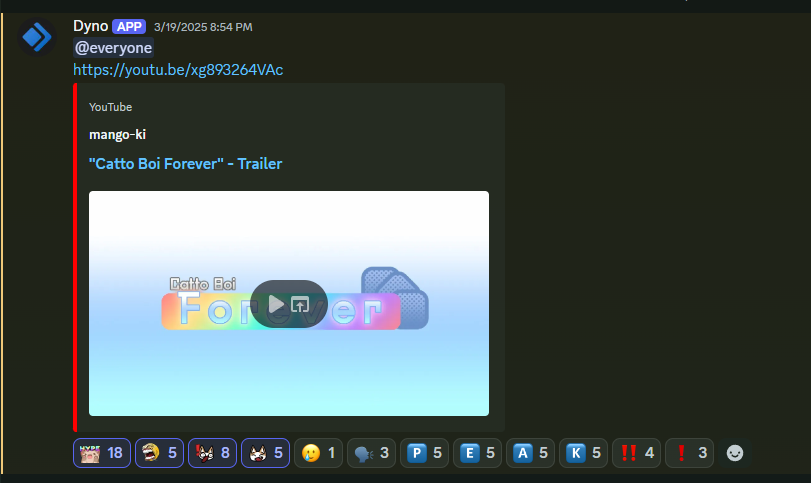

three days ago, the [trailer for the long-awaited Catto Boi Forever](https://youtu.be/xg893264VAc?si=_RlsGx62V363bkQ1) was uploaded to youtube. i was uh first notified about this on the catto land discord

i was confused at first, since there was a lot of activity. i notice a ping in the announcements channel, so everyone might be excited about what was posted there. i went to check.

holy shit.

## context

if you don't know what catto boi is, it's basically a series of games, with each entry evolving the engine and gameplay powering the game. back then (in like, 2020?) the first entry was made, *The Adventures of Catto Boi*. it was an entry for the luigikid creepypasta challenge. luigikid played this game, and it blew up on youtube. (if i recall)

since then, the developer of the game, mango-ki, has been making new entries for the franchise along with making the gameplay and engine better in general.

around 2023, he remade every single one of the entries, including *Catto Boi and the Legendary Fragments* and *Catto Boi's Village Quest*, which were merged together into one game, *Catto Boi Requiem* since uh apparently *Catto Boi's Village Quest* was kinda unoriginal in the catto boi series. it's true tho

i did talk about Catto Boi Requiem on my old site, in which i basically said how grateful i was for catto boi

*man i was kinda cringy back then..*

after mango-ki released *Catto Boi Requiem*, he announced that *Catto Boi Forever* was in the works! it had features like

- a level editor
- modding API
- multiplayer
- cosmetics
- bunch of cool stuff

*Catto Boi Forever* is what i'm gonna talk about in this post, so ermmmmm yeha

## the actual content

i just made this post to express my excitement.

i'm not going to spam the page with "YAYAYAYAYAYAYAYAY" I Promise.

i might just uh, highlight what i'm most excited about

### the modding API

modding is pretty hard when it comes to catto boi. (or at least i think it is? idk i've never tried)

iirc, modding catto boi required a tool called [UndertaleModdingTool](https://github.com/UnderminersTeam/UndertaleModTool). this tool allows you to decompile and unpack games made in Gamemaker, like undertale, deltarune, or of course, **Catto Boi**!

i don't know if this is true, since i barely paid attention to the modding scene, but modding was really hard if i remember. catto boi is compiled with the YoYo compiler, so i THINK it made te game it faster, (correct me if i'm wrong) but it also basically killed off modding.

so, no fun there. i can't make bad apple on catto boi.

or can i?

since *Catto Boi Forever* will come with a modding API, there's basically endless possibilities of what you can do now. you have the potential to make like, tf2 in catto boi

i'll, um, try that out when it releases

### multiplayer

**WARNING:** context i'm giving you is uh, purely from memory. please correct me if i'm wrong

there used to be multiplayer for catto boi (except it was a different game back then)

*Catto Boi Rena* i think was an entry in the catto boi franchise. it has no horror, and was purely just a multiplayer hangout game iirc. so basically, nothing to do other than chat (if there was one, which i actually have no idea about)

*Catto Boi Rena* is now merged into Forever.

and there's actually things to do now!

there's,,,

- gamemodes, very fun
- a WHOLE Storyline to go through
- and maybe just hangout again dunno

so yeah, that's pretty exciting!

## what now

i feel like those two sections didn't highlight my excitement enough. i will now spam in the post.

YAYAYAYAYAYAYAYAYAYAYAYAYAYAYAYAYAYAYAYAYAYAYAYAYAYAYAYAYAYAYAYAYAYAYAYAYAYAYAYAYAYAYAYAYAYAYAYAYAYAYAYAYAYAYA
YAYAYAYAYAYAYAYAYAYAYAYAYAYAYAYAYAYAYAYAYAYAYAYAYAYAYAYAYAYAYAYAYAYAYAYAYAYAYAYAYAYAYAYAYAYAYAYAYAYAYAYAYAYAYA
YAYAYAYAYAYAYAYAYAYAYAYAYAYAYAYAYAYAYAYAYAYAYAYAYAYAYAYAYAYAYAYAYAYAYAYAYAYAYAYAYAYAYAYAYAYAYAYAYAYAYAYAYAYAYA
YAYAYAYAYAYAYAYAYAYAYAYAYAYAYAYAYAYAYAYAYAYAYAYAYAYAYAYAYAYAYAYAYAYAYAYAYAYAYAYAYAYAYAYAYAYAYAYAYAYAYAYAYAYAYA
YAYAYAYAYAYAYAYAYAYAYAYAYAYAYAYAYAYAYAYAYAYAYAYAYAYAYAYAYAYAYAYAYAYAYAYAYAYAYAYAYAYAYAYAYAYAYAYAYAYAYAYAYAYAYA
YAYAYAYAYAYAYAYAYAYAYAYAYAYAYAYAYAYAYAYAYAYAYAYAYAYAYAYAYAYAYAYAYAYAYAYAYAYAYAYAYAYAYAYAYAYAYAYAYAYAYAYAYAYAYA
YAYAYAYAYAYAYAYAYAYAYAYAYAYAYAYAYAYAYAYAYAYAYAYAYAYAYAYAYAYAYAYAYAYAYAYAYAYAYAYAYAYAYAYAYAYAYAYAYAYAYAYAYAYAYA
YAYAYAYAYAYAYAYAYAYAYAYAYAYAYAYAYAYAYAYAYAYAYAYAYAYAYAYAYAYAYAYAYAYAYAYAYAYAYAYAYAYAYAYAYAYAYAYAYAYAYAYAYAYAYA
YAYAYAYAYAYAYAYAYAYAYAYAYAYAYAYAYAYAYAYAYAYAYAYAYAYAYAYAYAYAYAYAYAYAYAYAYAYAYAYAYAYAYAYAYAYAYAYAYAYAYAYAYAYAYA
YAYAYAYAYAYAYAYAYAYAYAYAYAYAYAYAYAYAYAYAYAYAYAYAYAYAYAYAYAYAYAYAYAYAYAYAYAYAYAYAYAYAYAYAYAYAYAYAYAYAYAYAYAYAYA
YAYAYAYAYAYAYAYAYAYAYAYAYAYAYAYAYAYAYAYAYAYAYAYAYAYAYAYAYAYAYAYAYAYAYAYAYAYAYAYAYAYAYAYAYAYAYAYAYAYAYAYAYAYAYA
YAYAYAYAYAYAYAYAYAYAYAYAYAYAYAYAYAYAYAYAYAYAYAYAYAYAYAYAYAYAYAYAYAYAYAYAYAYAYAYAYAYAYAYAYAYAYAYAYAYAYAYAYAYAYA
YAYAYAYAYAYAYAYAYAYAYAYAYAYAYAYAYAYAYAYAYAYAYAYAYAYAYAYAYAYAYAYAYAYAYAYAYAYAYAYAYAYAYAYAYAYAYAYAYAYAYAYAYAYAYA
YAYAYAYAYAYAYAYAYAYAYAYAYAYAYAYAYAYAYAYAYAYAYAYAYAYAYAYAYAYAYAYAYAYAYAYAYAYAYAYAYAYAYAYAYAYAYAYAYAYAYAYAYAYAYA
YAYAYAYAYAYAYAYAYAYAYAYAYAYAYAYAYAYAYAYAYAYAYAYAYAYAYAYAYAYAYAYAYAYAYAYAYAYAYAYAYAYAYAYAYAYAYAYAYAYAYAYAYAYAYA
YAYAYAYAYAYAYAYAYAYAYAYAYAYAYAYAYAYAYAYAYAYAYAYAYAYAYAYAYAYAYAYAYAYAYAYAYAYAYAYAYAYAYAYAYAYAYAYAYAYAYAYAYAYAYA
YAYAYAYAYAYAYAYAYAYAYAYAYAYAYAYAYAYAYAYAYAYAYAYAYAYAYAYAYAYAYAYAYAYAYAYAYAYAYAYAYAYAYAYAYAYAYAYAYAYAYAYAYAYAYA
YAYAYAYAYAYAYAYAYAYAYAYAYAYAYAYAYAYAYAYAYAYAYAYAYAYAYAYAYAYAYAYAYAYAYAYAYAYAYAYAYAYAYAYAYAYAYAYAYAYAYAYAYAYAYA
YAYAYAYAYAYAYAYAYAYAYAYAYAYAYAYAYAYAYAYAYAYAYAYAYAYAYAYAYAYAYAYAYAYAYAYAYAYAYAYAYAYAYAYAYAYAYAYAYAYAYAYAYAYAYA
YAYAYAYAYAYAYAYAYAYAYAYAYAYAYAYAYAYAYAYAYAYAYAYAYAYAYAYAYAYAYAYAYAYAYAYAYAYAYAYAYAYAYAYAYAYAYAYAYAYAYAYAYAYAYA
YAYAYAYAYAYAYAYAYAYAYAYAYAYAYAYAYAYAYAYAYAYAYAYAYAYAYAYAYAYAYAYAYAYAYAYAYAYAYAYAYAYAYAYAYAYAYAYAYAYAYAYAYAYAYA
YAYAYAYAYAYAYAYAYAYAYAYAYAYAYAYAYAYAYAYAYAYAYAYAYAYAYAYAYAYAYAYAYAYAYAYAYAYAYAYAYAYAYAYAYAYAYAYAYAYAYAYAYAYAYA
YAYAYAYAYAYAYAYAYAYAYAYAYAYAYAYAYAYAYAYAYAYAYAYAYAYAYAYAYAYAYAYAYAYAYAYAYAYAYAYAYAYAYAYAYAYAYAYAYAYAYAYAYAYAYA
YAYAYAYAYAYAYAYAYAYAYAYAYAYAYAYAYAYAYAYAYAYAYAYAYAYAYAYAYAYAYAYAYAYAYAYAYAYAYAYAYAYAYAYAYAYAYAYAYAYAYAYAYAYAYA
YAYAYAYAYAYAYAYAYAYAYAYAYAYAYAYAYAYAYAYAYAYAYAYAYAYAYAYAYAYAYAYAYAYAYAYAYAYAYAYAYAYAYAYAYAYAYAYAYAYAYAYAYAYAYA
YAYAYAYAYAYAYAYAYAYAYAYAYAYAYAYAYAYAYAYAYAYAYAYAYAYAYAYAYAYAYAYAYAYAYAYAYAYAYAYAYAYAYAYAYAYAYAYAYAYAYAYAYAYAYA
YAYAYAYAYAYAYAYAYAYAYAYAYAYAYAYAYAYAYAYAYAYAYAYAYAYAYAYAYAYAYAYAYAYAYAYAYAYAYAYAYAYAYAYAYAYAYAYAYAYAYAYAYAYAYA
YAYAYAYAYAYAYAYAYAYAYAYAYAYAYAYAYAYAYAYAYAYAYAYAYAYAYAYAYAYAYAYAYAYAYAYAYAYAYAYAYAYAYAYAYAYAYAYAYAYAYAYAYAYAYA
YAYAYAYAYAYAYAYAYAYAYAYAYAYAYAYAYAYAYAYAYAYAYAYAYAYAYAYAYAYAYAYAYAYAYAYAYAYAYAYAYAYAYAYAYAYAYAYAYAYAYAYAYAYAYA
YAYAYAYAYAYAYAYAYAYAYAYAYAYAYAYAYAYAYAYAYAYAYAYAYAYAYAYAYAYAYAYAYAYAYAYAYAYAYAYAYAYAYAYAYAYAYAYAYAYAYAYAYAYAYA
YAYAYAYAYAYAYAYAYAYAYAYAYAYAYAYAYAYAYAYAYAYAYAYAYAYAYAYAYAYAYAYAYAYAYAYAYAYAYAYAYAYAYAYAYAYAYAYAYAYAYAYAYAYAYA
YAYAYAYAYAYAYAYAYAYAYAYAYAYAYAYAYAYAYAYAYAYAYAYAYAYAYAYAYAYAYAYAYAYAYAYAYAYAYAYAYAYAYAYAYAYAYAYAYAYAYAYAYAYAYA
YAYAYAYAYAYAYAYAYAYAYAYAYAYAYAYAYAYAYAYAYAYAYAYAYAYAYAYAYAYAYAYAYAYAYAYAYAYAYAYAYAYAYAYAYAYAYAYAYAYAYAYAYAYAYA
YAYAYAYAYAYAYAYAYAYAYAYAYAYAYAYAYAYAYAYAYAYAYAYAYAYAYAYAYAYAYAYAYAYAYAYAYAYAYAYAYAYAYAYAYAYAYAYAYAYAYAYAYAYAYA
YAYAYAYAYAYAYAYAYAYAYAYAYAYAYAYAYAYAYAYAYAYAYAYAYAYAYAYAYAYAYAYAYAYAYAYAYAYAYAYAYAYAYAYAYAYAYAYAYAYAYAYAYAYAYA
YAYAYAYAYAYAYAYAYAYAYAYAYAYAYAYAYAYAYAYAYAYAYAYAYAYAYAYAYAYAYAYAYAYAYAYAYAYAYAYAYAYAYAYAYAYAYAYAYAYAYAYAYAYAYA
YAYAYAYAYAYAYAYAYAYAYAYAYAYAYAYAYAYAYAYAYAYAYAYAYAYAYAYAYAYAYAYAYAYAYAYAYAYAYAYAYAYAYAYAYAYAYAYAYAYAYAYAYAYAYA
YAYAYAYAYAYAYAYAYAYAYAYAYAYAYAYAYAYAYAYAYAYAYAYAYAYAYAYAYAYAYAYAYAYAYAYAYAYAYAYAYAYAYAYAYAYAYAYAYAYAYAYAYAYAYA
YAYAYAYAYAYAYAYAYAYAYAYAYAYAYAYAYAYAYAYAYAYAYAYAYAYAYAYAYAYAYAYAYAYAYAYAYAYAYAYAYAYAYAYAYAYAYAYAYAYAYAYAYAYAYA
YAYAYAYAYAYAYAYAYAYAYAYAYAYAYAYAYAYAYAYAYAYAYAYAYAYAYAYAYAYAYAYAYAYAYAYAYAYAYAYAYAYAYAYAYAYAYAYAYAYAYAYAYAYAYA
YAYAYAYAYAYAYAYAYAYAYAYAYAYAYAYAYAYAYAYAYAYAYAYAYAYAYAYAYAYAYAYAYAYAYAYAYAYAYAYAYAYAYAYAYAYAYAYAYAYAYAYAYAYAYA
YAYAYAYAYAYAYAYAYAYAYAYAYAYAYAYAYAYAYAYAYAYAYAYAYAYAYAYAYAYAYAYAYAYAYAYAYAYAYAYAYAYAYAYAYAYAYAYAYAYAYAYAYAYAYA
YAYAYAYAYAYAYAYAYAYAYAYAYAYAYAYAYAYAYAYAYAYAYAYAYAYAYAYAYAYAYAYAYAYAYAYAYAYAYAYAYAYAYAYAYAYAYAYAYAYAYAYAYAYAYA
YAYAYAYAYAYAYAYAYAYAYAYAYAYAYAYAYAYAYAYAYAYAYAYAYAYAYAYAYAYAYAYAYAYAYAYAYAYAYAYAYAYAYAYAYAYAYAYAYAYAYAYAYAYAYA
YAYAYAYAYAYAYAYAYAYAYAYAYAYAYAYAYAYAYAYAYAYAYAYAYAYAYAYAYAYAYAYAYAYAYAYAYAYAYAYAYAYAYAYAYAYAYAYAYAYAYAYAYAYAYA
YAYAYAYAYAYAYAYAYAYAYAYAYAYAYAYAYAYAYAYAYAYAYAYAYAYAYAYAYAYAYAYAYAYAYAYAYAYAYAYAYAYAYAYAYAYAYAYAYAYAYAYAYAYAYA
YAYAYAYAYAYAYAYAYAYAYAYAYAYAYAYAYAYAYAYAYAYAYAYAYAYAYAYAYAYAYAYAYAYAYAYAYAYAYAYAYAYAYAYAYAYAYAYAYAYAYAYAYAYAYA
YAYAYAYAYAYAYAYAYAYAYAYAYAYAYAYAYAYAYAYAYAYAYAYAYAYAYAYAYAYAYAYAYAYAYAYAYAYAYAYAYAYAYAYAYAYAYAYAYAYAYAYAYAYAYA
YAYAYAYAYAYAYAYAYAYAYAYAYAYAYAYAYAYAYAYAYAYAYAYAYAYAYAYAYAYAYAYAYAYAYAYAYAYAYAYAYAYAYAYAYAYAYAYAYAYAYAYAYAYAYA
YAYAYAYAYAYAYAYAYAYAYAYAYAYAYAYAYAYAYAYAYAYAYAYAYAYAYAYAYAYAYAYAYAYAYAYAYAYAYAYAYAYAYAYAYAYAYAYAYAYAYAYAYAYAYA
YAYAYAYAYAYAYAYAYAYAYAYAYAYAYAYAYAYAYAYAYAYAYAYAYAYAYAYAYAYAYAYAYAYAYAYAYAYAYAYAYAYAYAYAYAYAYAYAYAYAYAYAYAYAYA
YAYAYAYAYAYAYAYAYAYAYAYAYAYAYAYAYAYAYAYAYAYAYAYAYAYAYAYAYAYAYAYAYAYAYAYAYAYAYAYAYAYAYAYAYAYAYAYAYAYAYAYAYAYAYA
YAYAYAYAYAYAYAYAYAYAYAYAYAYAYAYAYAYAYAYAYAYAYAYAYAYAYAYAYAYAYAYAYAYAYAYAYAYAYAYAYAYAYAYAYAYAYAYAYAYAYAYAYAYAYA
YAYAYAYAYAYAYAYAYAYAYAYAYAYAYAYAYAYAYAYAYAYAYAYAYAYAYAYAYAYAYAYAYAYAYAYAYAYAYAYAYAYAYAYAYAYAYAYAYAYAYAYAYAYAYA
YAYAYAYAYAYAYAYAYAYAYAYAYAYAYAYAYAYAYAYAYAYAYAYAYAYAYAYAYAYAYAYAYAYAYAYAYAYAYAYAYAYAYAYAYAYAYAYAYAYAYAYAYAYAYA
YAYAYAYAYAYAYAYAYAYAYAYAYAYAYAYAYAYAYAYAYAYAYAYAYAYAYAYAYAYAYAYAYAYAYAYAYAYAYAYAYAYAYAYAYAYAYAYAYAYAYAYAYAYAYA
YAYAYAYAYAYAYAYAYAYAYAYAYAYAYAYAYAYAYAYAYAYAYAYAYAYAYAYAYAYAYAYAYAYAYAYAYAYAYAYAYAYAYAYAYAYAYAYAYAYAYAYAYAYAYA
YAYAYAYAYAYAYAYAYAYAYAYAYAYAYAYAYAYAYAYAYAYAYAYAYAYAYAYAYAYAYAYAYAYAYAYAYAYAYAYAYAYAYAYAYAYAYAYAYAYAYAYAYAYAYA
YAYAYAYAYAYAYAYAYAYAYAYAYAYAYAYAYAYAYAYAYAYAYAYAYAYAYAYAYAYAYAYAYAYAYAYAYAYAYAYAYAYAYAYAYAYAYAYAYAYAYAYAYAYAYA
YAYAYAYAYAYAYAYAYAYAYAYAYAYAYAYAYAYAYAYAYAYAYAYAYAYAYAYAYAYAYAYAYAYAYAYAYAYAYAYAYAYAYAYAYAYAYAYAYAYAYAYAYAYAYA
YAYAYAYAYAYAYAYAYAYAYAYAYAYAYAYAYAYAYAYAYAYAYAYAYAYAYAYAYAYAYAYAYAYAYAYAYAYAYAYAYAYAYAYAYAYAYAYAYAYAYAYAYAYAYA
YAYAYAYAYAYAYAYAYAYAYAYAYAYAYAYAYAYAYAYAYAYAYAYAYAYAYAYAYAYAYAYAYAYAYAYAYAYAYAYAYAYAYAYAYAYAYAYAYAYAYAYAYAYAYA
YAYAYAYAYAYAYAYAYAYAYAYAYAYAYAYAYAYAYAYAYAYAYAYAYAYAYAYAYAYAYAYAYAYAYAYAYAYAYAYAYAYAYAYAYAYAYAYAYAYAYAYAYAYAYA
YAYAYAYAYAYAYAYAYAYAYAYAYAYAYAYAYAYAYAYAYAYAYAYAYAYAYAYAYAYAYAYAYAYAYAYAYAYAYAYAYAYAYAYAYAYAYAYAYAYAYAYAYAYAYA
YAYAYAYAYAYAYAYAYAYAYAYAYAYAYAYAYAYAYAYAYAYAYAYAYAYAYAYAYAYAYAYAYAYAYAYAYAYAYAYAYAYAYAYAYAYAYAYAYAYAYAYAYAYAYA
YAYAYAYAYAYAYAYAYAYAYAYAYAYAYAYAYAYAYAYAYAYAYAYAYAYAYAYAYAYAYAYAYAYAYAYAYAYAYAYAYAYAYAYAYAYAYAYAYAYAYAYAYAYAYA
YAYAYAYAYAYAYAYAYAYAYAYAYAYAYAYAYAYAYAYAYAYAYAYAYAYAYAYAYAYAYAYAYAYAYAYAYAYAYAYAYAYAYAYAYAYAYAYAYAYAYAYAYAYAYA
YAYAYAYAYAYAYAYAYAYAYAYAYAYAYAYAYAYAYAYAYAYAYAYAYAYAYAYAYAYAYAYAYAYAYAYAYAYAYAYAYAYAYAYAYAYAYAYAYAYAYAYAYAYAYA
YAYAYAYAYAYAYAYAYAYAYAYAYAYAYAYAYAYAYAYAYAYAYAYAYAYAYAYAYAYAYAYAYAYAYAYAYAYAYAYAYAYAYAYAYAYAYAYAYAYAYAYAYAYAYA
YAYAYAYAYAYAYAYAYAYAYAYAYAYAYAYAYAYAYAYAYAYAYAYAYAYAYAYAYAYAYAYAYAYAYAYAYAYAYAYAYAYAYAYAYAYAYAYAYAYAYAYAYAYAYA
YAYAYAYAYAYAYAYAYAYAYAYAYAYAYAYAYAYAYAYAYAYAYAYAYAYAYAYAYAYAYAYAYAYAYAYAYAYAYAYAYAYAYAYAYAYAYAYAYAYAYAYAYAYAYA
YAYAYAYAYAYAYAYAYAYAYAYAYAYAYAYAYAYAYAYAYAYAYAYAYAYAYAYAYAYAYAYAYAYAYAYAYAYAYAYAYAYAYAYAYAYAYAYAYAYAYAYAYAYAYA
YAYAYAYAYAYAYAYAYAYAYAYAYAYAYAYAYAYAYAYAYAYAYAYAYAYAYAYAYAYAYAYAYAYAYAYAYAYAYAYAYAYAYAYAYAYAYAYAYAYAYAYAYAYAYA
YAYAYAYAYAYAYAYAYAYAYAYAYAYAYAYAYAYAYAYAYAYAYAYAYAYAYAYAYAYAYAYAYAYAYAYAYAYAYAYAYAYAYAYAYAYAYAYAYAYAYAYAYAYAYA
YAYAYAYAYAYAYAYAYAYAYAYAYAYAYAYAYAYAYAYAYAYAYAYAYAYAYAYAYAYAYAYAYAYAYAYAYAYAYAYAYAYAYAYAYAYAYAYAYAYAYAYAYAYAYA
YAYAYAYAYAYAYAYAYAYAYAYAYAYAYAYAYAYAYAYAYAYAYAYAYAYAYAYAYAYAYAYAYAYAYAYAYAYAYAYAYAYAYAYAYAYAYAYAYAYAYAYAYAYAYA
YAYAYAYAYAYAYAYAYAYAYAYAYAYAYAYAYAYAYAYAYAYAYAYAYAYAYAYAYAYAYAYAYAYAYAYAYAYAYAYAYAYAYAYAYAYAYAYAYAYAYAYAYAYAYA
YAYAYAYAYAYAYAYAYAYAYAYAYAYAYAYAYAYAYAYAYAYAYAYAYAYAYAYAYAYAYAYAYAYAYAYAYAYAYAYAYAYAYAYAYAYAYAYAYAYAYAYAYAYAYA
