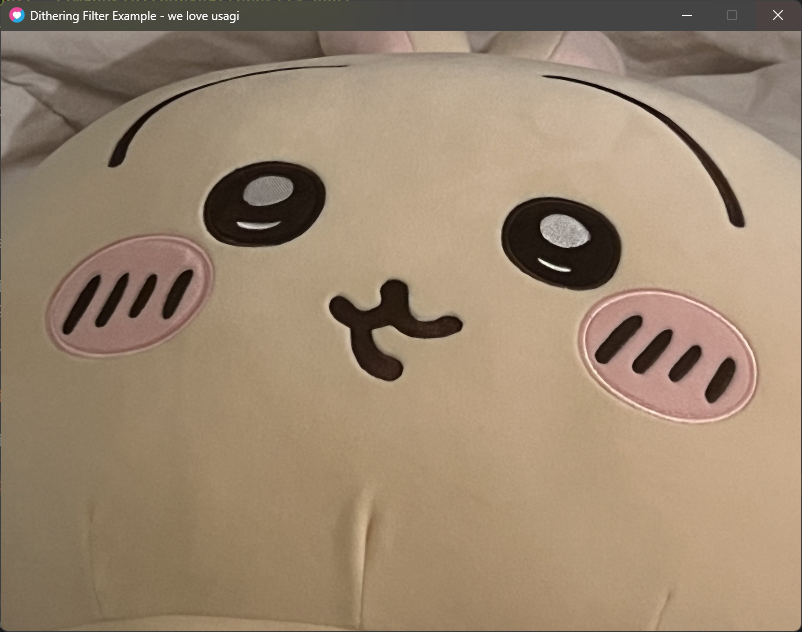
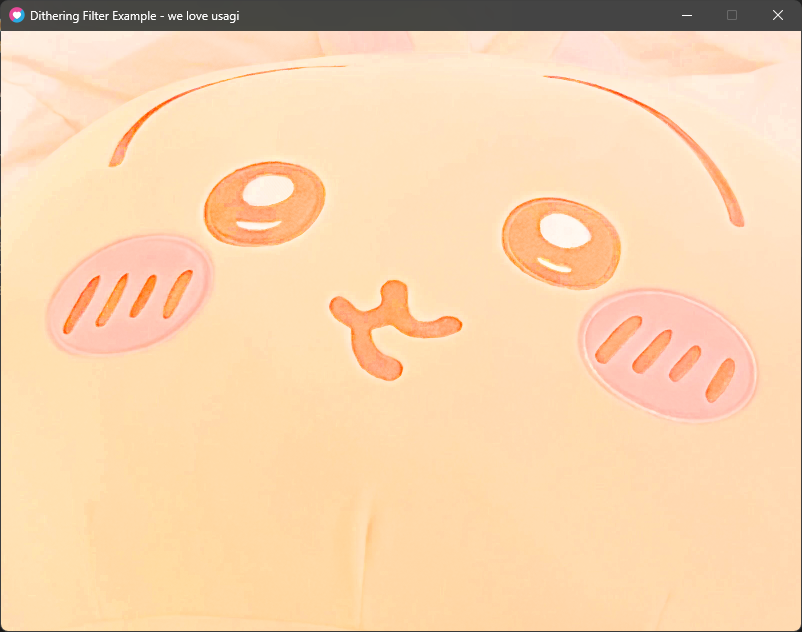
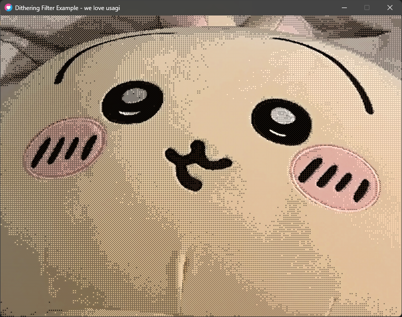
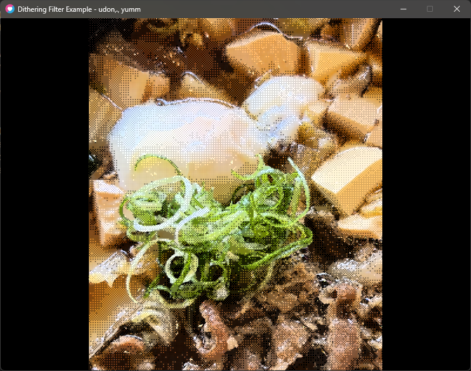
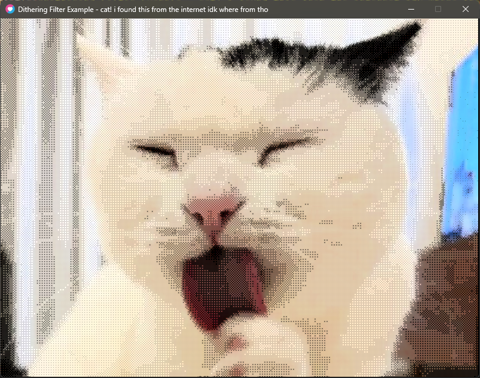
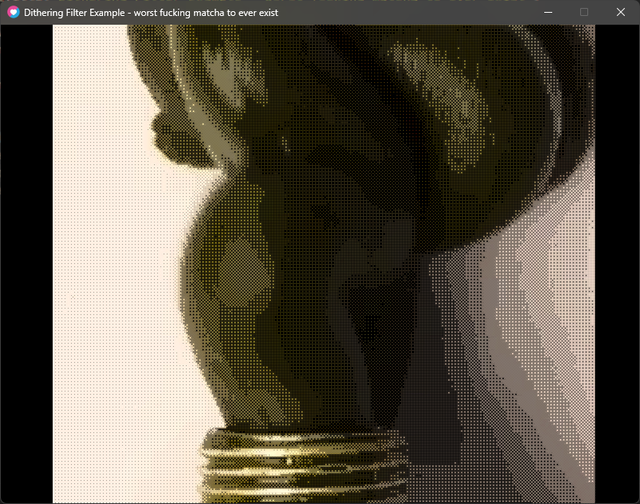
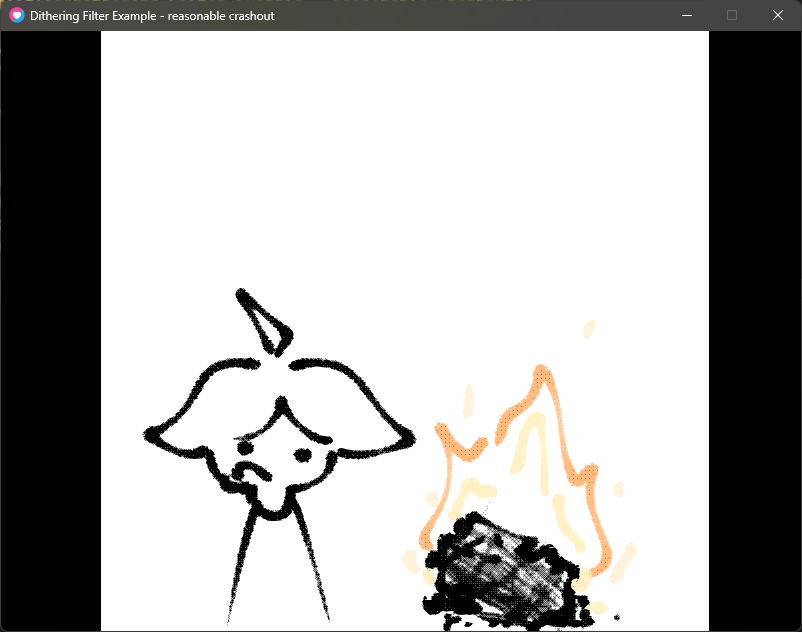

browsing some websites, i can uh see it's pretty common to have an image, or thumbnail with a blog post. i've always wanted one but i also wanted one that would fit the style of my website. i see nothing on the internet that will do it for me, and i might want to customize my image in ways that existing tools may not be able to.

so basically, i'm making an image filter in my own style for no reason.

## how is my website styled anyway?

elements like the background, or banner, are covered with a dithering texture. this dithering texture is all black, and i mostly just added them to add some texture to my website

the textures are all black, and i made them all in aseprite (really great app btw u should get it)

what that basically does is,,

- have an image, fully colored
- put a dithering image on top of it

that makes the colors in the image appear darker.

also, the dithering images aren't varied, it's fixed to one darkness value. (or whatever it should be called) how this would work in my code is,,,

```js
// tailwind.config.mjs
// yes, i know there's a new way to do this stuff in a new tailwind update but,, wtv

backgroundImage: {
    "dither-0": "url(../images/dither-patterns/0.png)",
    "dither-1": "url(../images/dither-patterns/1.png)",
    "dither-2": "url(../images/dither-patterns/2.png)",
    "dither-3": "url(../images/dither-patterns/3.png)",
    "dither-4": "url(../images/dither-patterns/4.png)",
    "dither-5": "url(../images/dither-patterns/5.png)",
    "dither-6": "url(../images/dither-patterns/6.png)",
    "dither-7": "url(../images/dither-patterns/7.png)",
    "dither-8": "url(../images/dither-patterns/8.png)",
    "dither-9": "url(../images/dither-patterns/9.png)",
    "dither-10": "url(../images/dither-patterns/10.png)",
    "dither-11": "url(../images/dither-patterns/11.png)",
    "dither-12": "url(../images/dither-patterns/12.png)",
    "dither-13": "url(../images/dither-patterns/13.png)",
    "dither-14": "url(../images/dither-patterns/14.png)",
    "dither-15": "url(../images/dither-patterns/15.png)",
    "dither-16": "url(../images/dither-patterns/16.png)",
},
```

using these in my code allows me to add these easily in some div

so, how can we use this to make this filter?

## what i'll do ig

these are the steps i'll take:

- make each pixel in an image the brightest it can be
- add the dithering over it

seems simple enough.

also, before i forget to mention, i will be using Love2D. Love2D is a pretty easily framework for making 2D games in the programming language Lua. Lua's a simple language for me soooooo yeah pretty obvious pick for me

## actually doing it

for reference, i will be using this image of an usagi plush i bought at miniso for the filter.



there will be other examples at the end of the post when the filter is finished.

### making it bright

this is pretty simple enough. i'll share what i did to do that.

also, it's pretty important that the color values (r, g, and b) are normalized.

#### who's the largest?

this is uh, even more simple. all we have to do is pick the largest color value from the pixel of an image.

infact, so simple it's only a few lines.

```glsl
vec4 pixel = Texel(texture, texture_coords);
float largest = max(pixel.r, max(pixel.g, pixel.b));
```

why will we be using this? to use it obviously.

#### division

we will be using this large value to divide!

there will be a time where this largest value will be zero, so we'll check to ensure we don't accidentally divide by zero:

```glsl
// ensure largest isn't zero, so we don't divide by zero (that would be bad!!)
if (largest == 0.0) {
    return vec4(1.0);
}
```

that just returns black.

anyways, we can divide! this is very simple, we just divide the color of the pixel by the largest value.

```glsl
return vec4((pixel.rgb / largest), pixel.a);
```

#### results

with this "shine bright like a diamond" code in place, we can test to see what the image looks like now!



very bright. still fat like always though

### dithering

this is the probably complicated part. here we will use the [ordered dithering algorithm](https://en.wikipedia.org/wiki/Ordered_dithering), since it's what i use for my website, so it'll fit in nicely

#### defining thresholds

first off, let's define the bayer matrix for the thresholds, and also the size of the bayer matrix..

```glsl
const int N = 4;

const float bayerMatrix[16] = float[16](
    0.0,  8.0,  2.0, 10.0,
    12.0, 4.0, 14.0, 6.0,
    3.0, 11.0, 1.0, 9.0,
    15.0, 7.0, 13.0, 5.0
);
```

#### getting the matrix

we'll pick out something from this later. next, we will get the index for the matrix, based on the x and y coords of the screen

```glsl
int x = int(mod(screen_coords.x, float(N)));
int y = int(mod(screen_coords.y, float(N)));

int index = y * N + x;
```

#### get the threshold

using that index from, we can pick out from our bayer matrix and get the threshold

```glsl
float threshold = (bayerMatrix[index] + 0.5) / 16.0;
```

#### the final color

finally, we assign a value to a variable, `ditheredValue`. if the largest color value is less than the threshold, then it should be zero. otherwise, it should be one. after that, we multiply the bright color we made earlier, with our dithered value.

```glsl
float ditheredValue = largest < threshold ? 0.0 : 1.0;

return vec4((pixel.rgb / largest) * ditheredValue, pixel.a);
```

phew! we're done!

TL;DR...

using the [ordered dithering algorithm](https://en.wikipedia.org/wiki/Ordered_dithering), we define a bayer matrix with all the thresholds we need. based off of the screen coords, we pick one of the thresholds. then, we make the final color black, or the brightest color, based off whether the largest color value is more, or less than the threshold we picked out.

#### results

this looks really good in my opinion! i think i might need to make the patterns bigger, but that'll be for later.

note it probably looks bad due to the sizing, and also astro compresses every image uploaded here. that's not my problem



## examples,,,,, woo

i've collected a few of the best images together, ones that would look nice with the filter. here you go






## what now?

in the future, i'll probably convert this to a command-line tool that anyone could use (for windows ig). the only use i'll have is making cool images.

i'll probably use this for the banner on the website.

anyways, i'll work on blog post thumbnails, just not yet. i'll probably do that once i work on the command-line tool.
