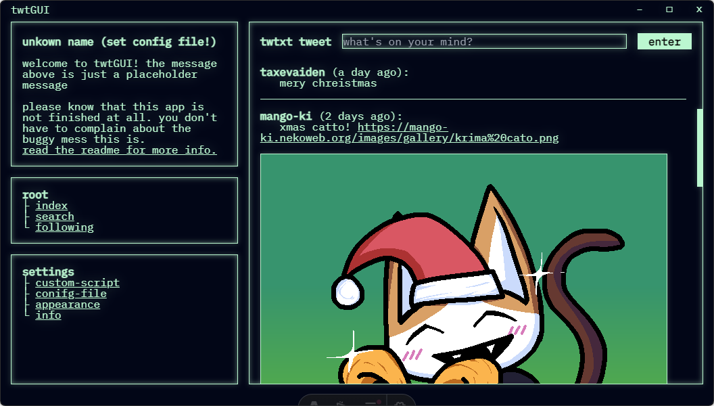
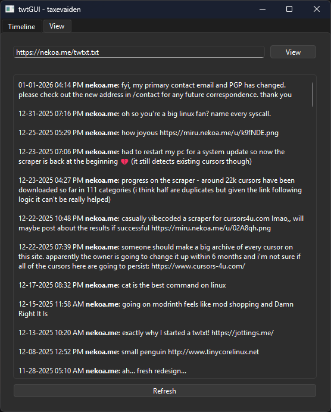
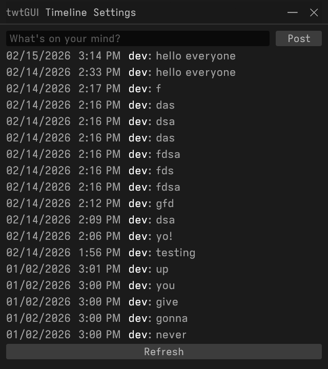
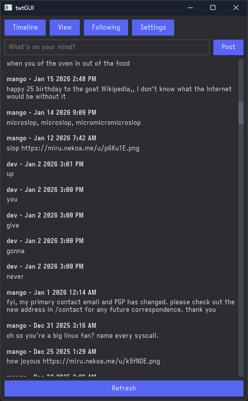
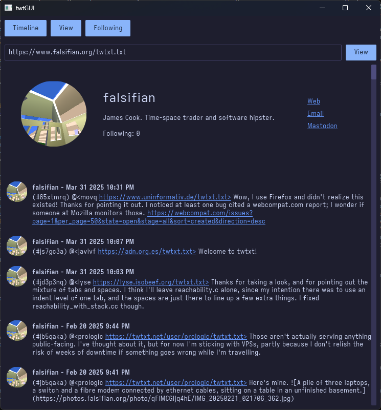
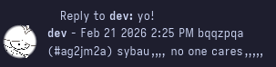
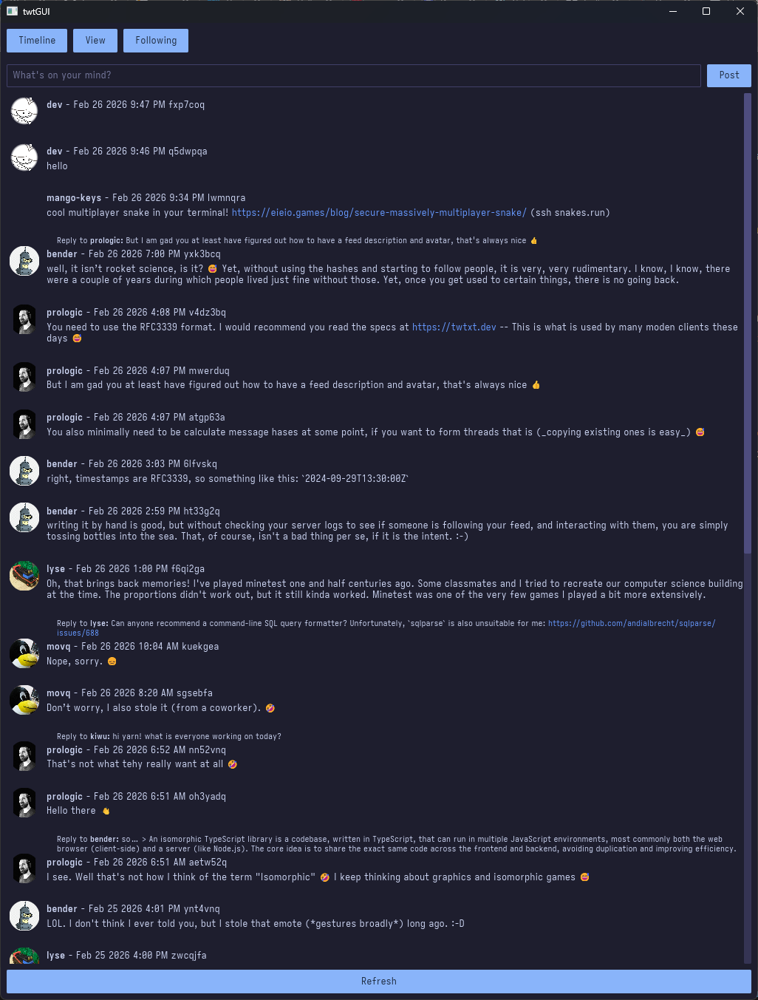

for a while now i've been working on a GUI client for the twtxt protocol ([what is twtxt?](https://twtxt.readthedocs.io/en/latest/))

i started making one when i was first introduced to twtxt by mango-ki. i started using it and thought it was pretty neat, but i was getting tired of having to use the terminal. (this was the first [twtxt client by buckket](https://github.com/buckket/twtxt)) so i made by own!

## electron

i decided to use electron to make the client. this was the time when i worked on websites A LOT so i thought this was a good choice. it would also be easier to style too

i also used the astro framework for it aswell,, which was kinda an odd choice and how i actually managed to use it with electron was strange--i just started a whole web server on your pc and had electron connect to it. i used node.js to call the twtxt client's commands, and then parsed the output to display it in the GUI. very weird but it worked!



anddd then i realized how painful it would be to further develop this

"why the hell did i do `twtxt tweet` with node.js instead of appending lines myself"

"who the fuck starts a web server and has electron connect to it just put the html in electron??"

"why would you MANUALLY parse the output of `twtxt timeline`?? you have less control!"

so eventually i stopped working on it. it was the coolest looking client tho!

## qt

when developing the electron client, someone suggested that i should use qt instead. (qt's a really cool cross-platform framework for developing GUI applications) i didn't have any expereince with c++, so i continued to work on the electron client. after realizing that the electron client wouldn't be a good expereince to further develop, i started looking at qt. i thought this would be a good way to learn c++ in general so i went ahead and rewrote twtGUI

instead of calling the twtxt client's commands, i did the parsing and downloading myself. appending lines to the end of a twtxt.txt file and parsing were trivial to implement in c++,, but i did have to do a little more work for donwloading since i used libcurl (and then right after i realized you could do downloads with qt already But ummmm its ok). it looked great!



i made the client start new threads for each feed that it has to download, so it
  - wouldn't block the GUI (it doesn't run on the GUI thread)
  - just loads faster
  
i also made it automatically cache the feeds you download, so you don't have to unnecessarily make requests and process an Entire feed. overtime, i started adding more and more features (like colored names) and everything was looking great Until i hit a roadblock

for some reason, when i clicked the Refresh button in either the timeline or the view page, the client would crash with an exception saying "Unknown signal." i suspected it had something to do with the way i was handling the threads, after all the code for deleting threads that were completed *did* seem a little risky,, or maybe i was clearing the feed wrong? or adding tweets to the feed wrong? i don't know!! 

a while ago, i did find out that it downloaded the feeds just fine, and it even got to the parsing stage! it only crashed when it had to add tweets,, i knew that in c++ i had to manage memory myself but that seemed really painful so

screw c++ we are rewriting twtGUI in rust!!

(to this day i still don't know what caused the unknown signal)

## rust

rust is very fast!

### egui

for this very short-lived version of twtGUI i decided to use egui, an immediate-style gui framework. it's designed for game engines as far as i know, but it *can* also be used for desktop applications too!

again, parsing and appending lines to the twtxt.txt were trivial in rust (and were actually even better for this imo) but i eventually quit cause i did NOT want to continue using an immediate-style gui framework. egui (as i mentioned before) is designed for game engines i think so it wouldn't really be good for desktop applications like c++,, plus i had to do a LOT of hacky things to get basic layout stuff working (like making every widget the same width as the window?? how is this not done by default)



i do think the custom titlebar was cool. i don't know if you could implement it in something like the gui framework i'm about to talk about, but uh not like i need it

### iced

iced is a gui framework inspired by [The Elm Architecture](https://guide.elm-lang.org/architecture/). instead of defining what something like a button does in an if statement for when it's clicked (which is what i had to do with egui):

```rs
if button.clicked() {
  do_something()
}
```

you could just make the button fire a message:

```rs
button("Click me!")
  .on_press(Message::ButtonClicked);
```

and define what the message does:

```rs
Message::ButtonClicked => {
  println!("Button clicked!")
}
```

this makes the code a lot managable for me

messages can also just be used everywhere, which is very useful for threads when they're finished downloading!

(this is very basic don't copy this code)

[halloy, an IRC client](https://halloy.chat/index.html) also uses iced, so i could ~~steal~~ look at their code to see how they implement some things

again i implemented the stuff that the old client had: downloading, parsing, sending, etc........ </br>
it already started to look great!



then i implemented the [twtxt v2 specification](https://twtxt.dev), developed by the devs of [twtxt.net](https://twtxt.net). i haven't really looked into it but twtxt.net is a [yarn.social](https://yarn.social/) pod which is "a decentralised self-hosted social media based on the Twtxt format." if you're looking for an alternative to twitter/bluesky you could check it out (and maybe even host one yourself)

the twtxt v2 specification adds on a couple of extensions to the twtxt format, like metadata defining the feed's author, description, and even its avatar, or tweet hashes. tweet hashes and metadata were easy to implement. i had to change my downloading code a litte to allow for avatars to be downloaded, but with only these two added, twtGUI was looking cooler than before!



i was going to implement the twtxt v2 specification for the c++ client, but then i realized how painful it would be. like i could parse the metadata, but at what cost? where would i display an avatar on a QListView with my own delegate for rich text? how would i do it with the rest of the c++ code not falling apart?

i also implemented the tweet subject extension (which allowed for threads and replies). i only have a basic implementation--for now it just shows what a tweet is replying to.



but in the future i'll try and get threads working!

i'll also mention, even when running on a laptop that is MUCH SLOWER than my pc, it downloads and parses 11 feeds really fast! probably because it's on linux, but still!

hopefully this is something i can maintain long-term (i'm so bored i have nothing else to do other than play osu)



[source code](https://github.com/taxevaiden/twtGUI)

## what now

i think once i get twtGUI in a good state i'll use twtxt more often. i haven't posted to my feed in a while and i'm mostly just using twitter (the shit i keep finding on there is crazy)

if you're reading this post and you have a twtxt feed but you don't have some metadata Can you please add it ,i want my timeline feed to look cool. all you have to do is put something like

```
# nick = john
# description = My (awesome) personal feed!
# url = https://example.com/twtxt.txt
# avatar = https://example.com/avatar.png
# following = jane https://example.com/twtxt.txt
# following = joe https://example.com/twtxt.txt
```

at the top of your file and you're done

ok bye
