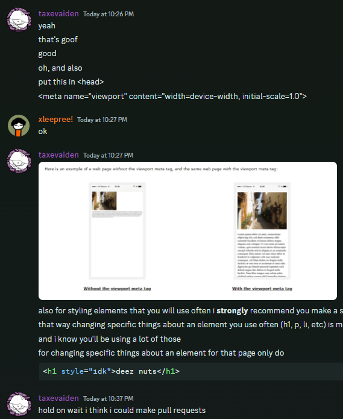

some point in the development of this site, my friend decided that it would be nice if they had their own website. i thought it would be kind of a good idea, cause i knew he liked to write stuff and this,, is his way of sharing his stuff i guess?

(he has a "projects" page what else would he have,)

but anyways, i kinda just wrote this post just to tell you guys about his website. he's still learning HTML.. i'm teaching him as we speak , , . ,. i kinda decided he shouldn't use astro since he is far from going on that land (would he even know how to use `npm`? who knows)

and yes i am literally teaching him rn (i'm so Kind and generous aMAI right guys)

(OH MY OGD WHAT THE FUCK HAPPENED TO THE IMAGE WEhy IS IT So BAD ?? :sob: that's astro for ya)

if you want to visit go Here!

[xleepree.pages.dev](https://xleepree.pages.dev)

ok bye